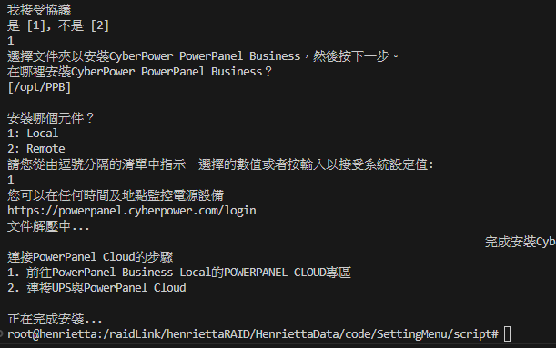

 
1.  至[官網](https://www.cyberpower.com/tw/zh/product/sku/powerpanel_business_for_linux#downloads)下載
    項目`PowerPanel Business Local/ Remote for Linux 32bit`
    使用`Local`選項  
2. 
3. 開通3052 port, 進入[Web控制頁](http://ningtahouse.asuscomm.com:3052)
4. 變更密碼