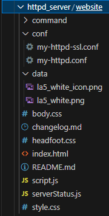
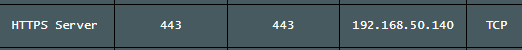
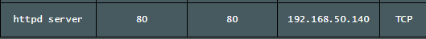
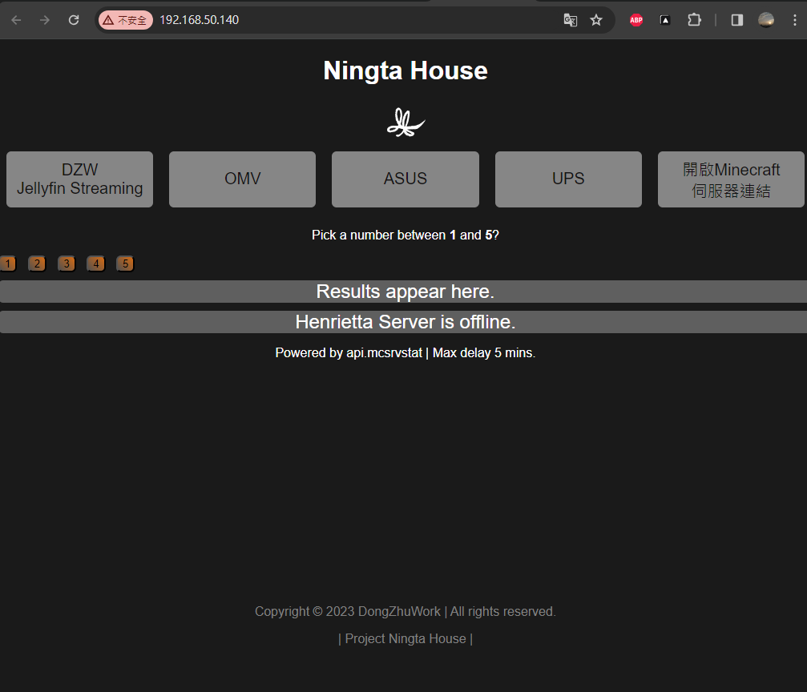
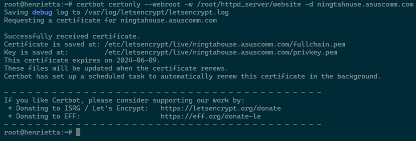

# 安裝Httpd Server
## 1. 在用戶根目錄創建httpd 資料夾  
    mkdir ~/httpd_server  
#### 並將相關網頁架構置入  

## 2. 初次設定SSL憑證  
### [在Debian上安裝snap](https://snapcraft.io/docs/installing-snap-on-debian)  
    apt-get update  
    apt-get upgrade 
    apt install snapd
    reboot #重啟系統  
    snap install core
    snap install hello-world #測試  
    hello-world #測試  

### [安裝certbot](https://certbot.eff.org/instructions?ws=apache&os=debianbuster)  
    snap install --classic certbot  
    ln -s /snap/bin/certbot /usr/bin/certbot #測試 

#### 確保wifi router正常轉接port

#### 執行一個簡易的httpd docker
需要有一個運行中的網頁讓SSL憑證網站試圖存取  

    docker run -d --name https-server -p 443:443 -p 80:80 \
    -v /root/httpd_server/website:/usr/local/apache2/htdocs \
    httpd:2.4

#### 於LAN內確定網站正常運作  

#### 申請憑證
    certbot certonly --webroot -w /root/httpd_server/website -d ningtahouse.asuscomm.com

#### 測試憑證自動化更新
    certbot renew --dry-run  

#### 刪除舊有docker 並使用新的設定創建
    docker rm https-server
#### 確保httpd.conf, httpd-ssl.conf檔案已經更新，將SSL密鑰路徑設置

[參考網站](https://hub.docker.com/_/httpd)
## 3. 使用完整版參數httpd docker 啟動
    docker run -d --name https-server -p 443:443 -p 80:80 \
    -v /etc/letsencrypt:/etc/letsencrypt:ro \
    -v /root/httpd_server/website/conf/my-httpd.conf:/usr/local/apache2/conf/httpd.conf \
    -v /root/httpd_server/website/conf/my-httpd-ssl.conf:/usr/local/apache2/conf/extra/httpd-ssl.conf \
    -v /root/httpd_server/website:/usr/local/apache2/htdocs \
    httpd:2.4

cp -rLf /etc/letsencrypt/live/ningtahouse.asuscomm.com /raidLink/henriettaRAID/HenriettaData/code/sslKeyHere #r 遞迴 #L 實體位置 #f 強制覆蓋  
chmod -R 777 /raidLink/henriettaRAID/HenriettaData/code/sslKeyHere
