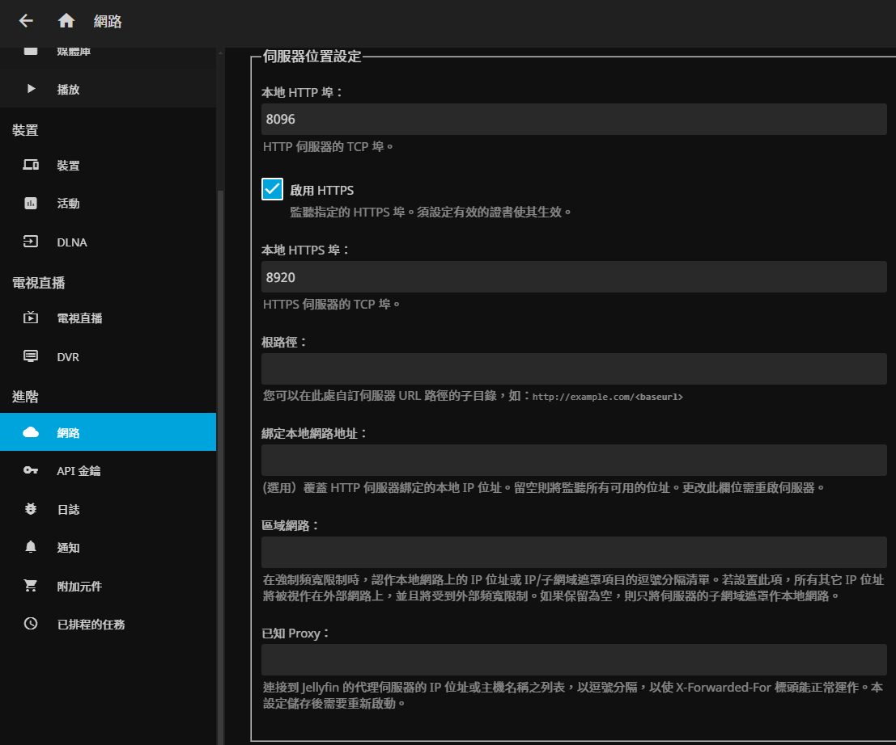

# 安裝Jellyfin
[參考網站](https://jellyfin.org/docs/general/installation/container/)
## 1.於用戶根目錄創建jellyfin緩存與設定資料夾  
  創建於SSD  
`mkdir -p ~/jellyfinSetting/{config,cache}`

## 2.啟動
  docker run -d --name jelly \
  --net=host \
  -v ~/jellyfinSetting/config:/config \
  -v ~/jellyfinSetting/cache:/cache \
  -v /raidLink/henriettaRAID:/media1 \
  jellyfin/jellyfin:latest

## 3.首次設定
[點擊8096 port](http://192.168.50.140:8096/)

## 4.設定SSL
目前設定失敗，僅8096 HTTP可成功  
