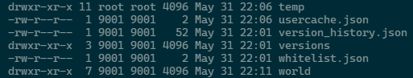

## 安裝minecraft docker 
1. Paper server 安裝指令  
> docker run -d -it \
  --name mc \
  -e MEMORYSIZE="26G" \
  -e INIT_MEMORY=1G -e MAX_MEMORY=26G \
  -p 25565:25565/tcp \
  -p 25565:25565/udp \
  -e EULA=TRUE \
  -e "TZ=Asia/Taipei" \
  -e ONLINE_MODE=TRUE \
  -v /home/mcserver:/data:rw \
  marctv/minecraft-papermc-server:latest  

  [參考](https://github.com/mtoensing/Docker-Minecraft-PaperMC-Server)

2. 下載multiverse plugin  
將下載到的plugin jar放置到server資料夾中的plugin  
當中包含
- Multiverse-Core 
- Multiverse-Portals
- Multiverse Nether portals  
- LuckPerms 
- Skript

[參考-新增plugin](https://docs.papermc.io/paper/adding-plugins)  
[參考-Multiverse插件群](https://hangar.papermc.io/Multiverse/Multiverse-Core)  
[Multiverse-地獄終界維護器](https://github.com/Multiverse/Multiverse-Core/wiki/Basics-(NetherPortals))  
[Multiverse說明](https://github.com/Multiverse/Multiverse-Core/wiki)  
[安裝權限管理插件](https://www.spigotmc.org/resources/luckperms.28140/)  
[安裝skript](https://www.spigotmc.org/resources/skript.114544/)

3. 重啟server
在server輸入`plugins`，確保plugin被安裝成功

4. 將舊有的地圖複製進server目錄中  
並且確保該地圖的權限不是root之類的超高級別，導致server沒有權限讀取  

例如在該情況中temp為欲新增之地圖，而world為server所創建的地圖，可見兩者權限不同，使用各種方法讓temp可被Server讀取。  
  
`sudo chown -R 9001:root temp`

6. 設定玩家權限
- 6.1 創建和管理用戶  
添加權限給玩家：  
`lp user <username> permission set <permission.node> true`  
- 移除玩家的權限：  
`lp user <username> permission unset <permission.node>`  
- 6.2 創建和管理組
創建一個新組：  
`lp group create <groupname>`  
給組添加權限：  
`lp group <groupname> permission set <permission.node> true`  
從組中移除權限：  
`lp group <groupname> permission unset <permission.node>`  
- 6.3 玩家和組之間的管理  
將玩家添加到組：  
`lp user <username> parent add <groupname>`  
從組中移除玩家：  
`lp user <username> parent remove <groupname>`  
- 6.4：使用 Web 界面  
LuckPerms 提供了一個 web 界面工具（Web Editor），讓你可以更直觀地管理權限。使用以下命令打開 Web Editor：  
`lp editor`  
這將生成一個 URL，你可以在瀏覽器中打開該 URL 來進行權限的編輯。  
每次編輯完需在頁面中點及儲存，並將生成碼數入至遊戲中。   
- 6.5 : 為Group default 新增相關權限，以利查看世界與傳送世界  
`multiverse.access.*`   
`multiverse.teleport.*`  
`multiverse.core.list.who`  
`multiverse.core.list.worlds`  

- 6.6：應用和儲存更改  
在進行任何更改後，使用以下命令來重新加載 LuckPerms 配置和存儲的數據：  
`lp reload`  

5. 設定伺服器文件
- 將icon圖示複製至server資料夾中，並改名為server-icon.png  
- 修改server資料夾中的server.properties

7. 設定腳本  
設定[Skript腳本](Skript_intro.md)以實現許多自動化功能  
[網路說明](https://docs.skunity.com/guides)

- Vanilla server 安裝指令
    > docker run -d -it -p 25565:25565 --name mc -e "TZ=Asia/Taipei" \  
    -e EULA=TRUE -e ONLINE_MODE=TRUE -e INIT_MEMORY=1G -e MAX_MEMORY=28G \  
    -v /home/dzw_mc_data:/data itzg/minecraft-server

    > 當中 /home/dzw_mc_data為本地實體位置
