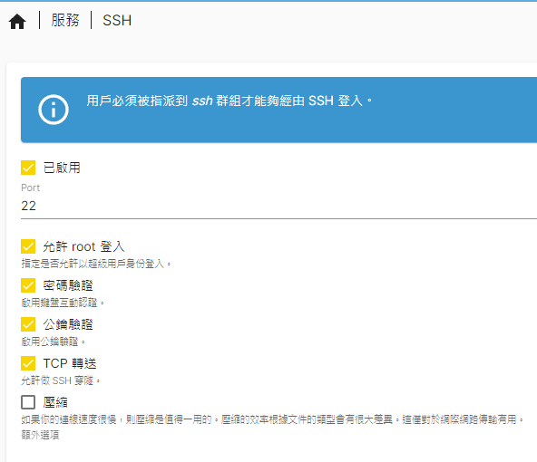

# 建立VS Code 的SSH連線
## 1. OMV設定
- 確保TCP轉送開啟
- 確保root或是遠端身分有在SSH群組中
- 

## 2. Router設定
- 確保虛擬伺服器port轉接正確
- 

## 3. Windows本機生成SSH Key
- 通常位於C:\Users\a8076\.ssh\Windows_id_rsa.pub

## 4. server 設置許可金鑰
- SHH資料夾通常為~/.ssh，並包含：
    > `authorized_keys  id_rsa  id_rsa.pub`  
- 將Windows_id_rsa.pub複製過去server端之~/.ssh
- 將許可金鑰添加至名單中
    > `cat Windows_id_rsa.pub >> authorized_keys`  
- 更改權限
    > `chmod 700 .ssh/`  
    > `chmod 600 .ssh/*`  

## 5. 可能的錯誤
- 當出現
> @@@@@@@@@@@@@@@@@@@@@@@@@@@@@@@@@@@@@@@@@@@@@@@@@@@@@@@@@@@  
> @       WARNING: POSSIBLE DNS SPOOFING DETECTED!          @  
> @@@@@@@@@@@@@@@@@@@@@@@@@@@@@@@@@@@@@@@@@@@@@@@@@@@@@@@@@@@  
> The ECDSA host key for [ningtahouse.asuscomm.com]:49527 has changed,  
> and the key for the corresponding IP address [114.25.154.113]:49527  
> is unknown. This could either mean that  
> DNS SPOOFING is happening or the IP address for the host  
> and its host key have changed at the same time.  
> @@@@@@@@@@@@@@@@@@@@@@@@@@@@@@@@@@@@@@@@@@@@@@@@@@@@@@@@@@@  
> @    WARNING: REMOTE HOST IDENTIFICATION HAS CHANGED!     @  
> @@@@@@@@@@@@@@@@@@@@@@@@@@@@@@@@@@@@@@@@@@@@@@@@@@@@@@@@@@@  
- 將本機端.ssh/known_hosts中的紀錄刪除

## [參考網站](https://www.raise-up.com.tw/web-design-news/ssh-key-tutorial.html/)