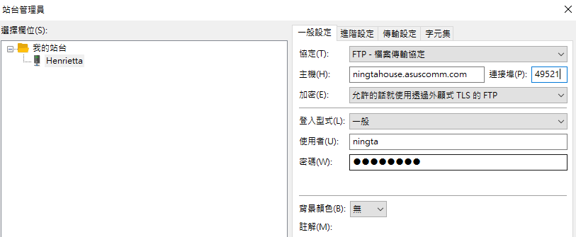
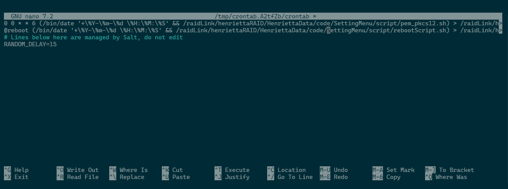

# 初始化後建議安裝順序
該流程使用於OVM 7  
1. [VScodeSSH設置](VScodeSSH.md)
2. [完成git版控](git_command.md)
3. [Wake-on-LAN設置](Wake-on-LAN.md)
4. [Docker安裝](Docker_install.md)
5. 設定捷徑至掛載磁碟  

    ln -s /srv/dev-disk-by-uuid-89fac8a0-bcac-4167-8ec3-03d8baa856b3 /raidLink

6. [Httpd-docker安裝與SSL設置](Httpd_install.md)

7. 安裝RAID 插件

    在web GUI 搜尋`openmediavault-md`

8. 安裝FTP 插件

    在web GUI 搜尋`openmediavault-ftp`  
    

9. [安裝JellyFin](Jellyfin_install.md)
10. 設定自動憑證複製轉換、開機自動程序  
    - 設定權限以利cron執行  
    chmod +x  /raidLink/henriettaRAID/HenriettaData/code/SettingMenu/script/rebootScript.sh

    linux 終端輸入`crontab -e`，將以下文字貼上  
    - 自動憑證複製轉換  
    0 0 * * 6 (echo ""; echo "Run at $(date)"; /raidLink/henriettaRAID/HenriettaData/code/SettingMenu/script/pem_pkcs12.sh) >> /raidLink/henriettaRAID/HenriettaData/code/SettingMenu/script/log/pem_pkcs12.log 2>&1

    - 開機自動執行docker  
    @reboot (echo ""; echo "Run at $(date)"; /raidLink/henriettaRAID/HenriettaData/code/SettingMenu/script/rebootScript.sh) >> /raidLink/henriettaRAID/HenriettaData/code/SettingMenu/script/log/rebootScript.log 2>&1

11. [安裝CyberPower UPS 軟體](CyberPower.md)

12. [安裝Minecraft server](Minecraft_docker.md)
